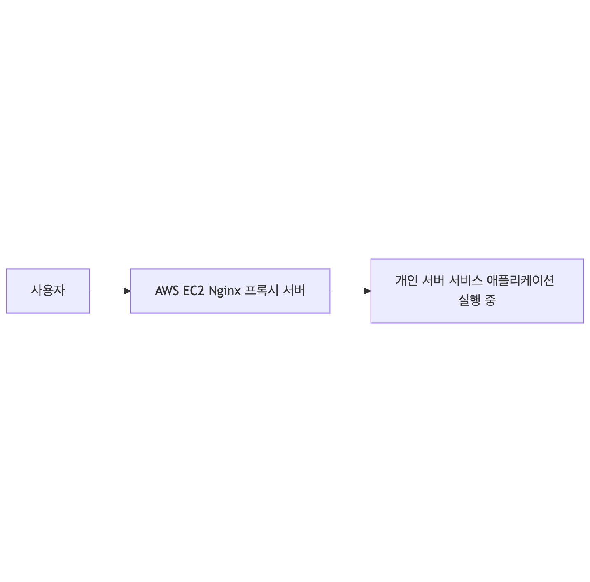

# 📦 배포 아키텍처 설명

## 1. 아키텍처 개요

우리 프로젝트의 배포 구조는 **AWS EC2 인스턴스 상에 Nginx를 구성한 프록시 서버**를 중심으로 이루어져 있으며, 실제 서비스 애플리케이션은 **외부의 별도 개인 서버에서 구동**됩니다.

## 2. 이러한 구조를 채택한 이유
### 🧾 AWS 프리티어의 성능 한계
AWS 프리티어(Free Tier)에서는 메모리나 CPU 자원이 제한된 인스턴스(t2.micro 등)만 제공되기 때문에,

우리가 필요한 수준의 성능 (예: AI 모델 처리, 대규모 API 요청 등)을 감당하기 어렵습니다.

따라서, 고사양의 애플리케이션 서버는 별도로 운영 중인 개인 서버에서 구동하도록 하고,
AWS 인프라는 중계 및 리버스 프록시 역할만 수행하도록 설계했습니다.

### 🔒 개인 서버의 IP/DNS 노출 방지
개인 서버는 보안상 외부에 직접 노출시키는 것이 바람직하지 않으며,

특히 개인 도메인을 직접 연결할 경우, 보안 위협 및 관리 부담이 증가할 수 있습니다.

그래서 AWS 상의 Nginx 프록시를 통해 공개 도메인을 연결하고,
프록시 서버가 내부적으로 개인 서버로 요청을 전달하도록 구성했습니다.

## 3. 기대 효과
보안 강화: 개인 서버의 직접 노출을 막음으로써 공격 표면을 최소화할 수 있습니다.

유연한 확장성: 필요 시 프록시 대상만 바꿔 다양한 서버로 트래픽 분산이 가능합니다.

비용 절감: AWS 프리티어는 프록시 목적에만 사용되므로 비용 효율적인 운영이 가능합니다.